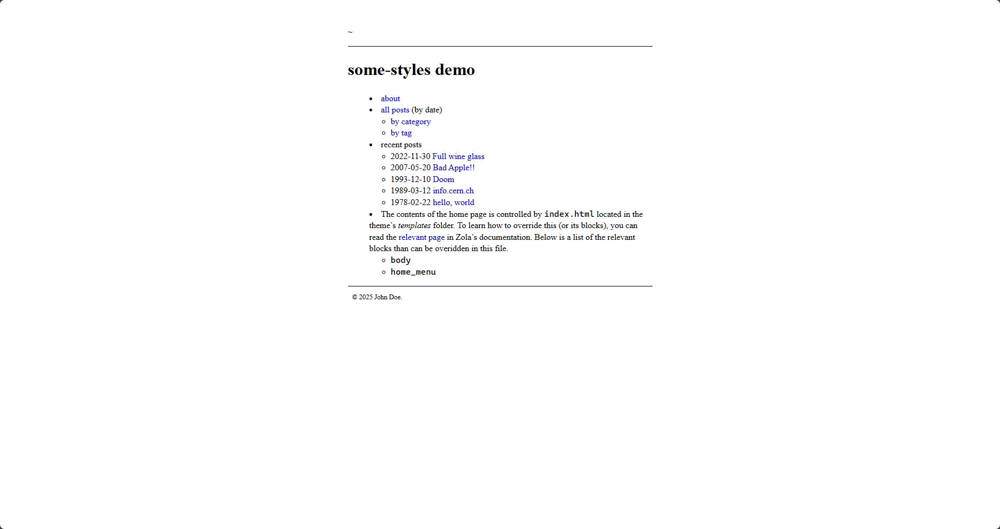

# some-styles

This is a Zola theme that is inspired by the [*no style, please!*][no-styles-please] theme, as well taking minor design cues from [Project Nayuki][nayuki-io], newspaper websites, [Practical Typography][practical-typograhy], as well as [Daniel Bowen’s website][daniel-bowen].

[zola-ssg]:         https://getzola.org/
[no-styles-please]: https://riggraz.dev/no-style-please/
[nayuki-io]:        https://www.nayuki.io/
[practical-typograhy]: https://practicaltypography.com/
[daniel-bowen]:     https://danielbowen.com/



## Installation and Setup

First download this theme to your `themes` directory

```
cd themes
git clone https://github.com/it-is-final/some-styles.git
```

and then enable it in your `config.toml`:

```
theme = "some-styles"
```

## Options

### Customise the home menu

If you do not have an `_index.md` file in the root of the `content` directory, first create one with the following contents:

```
+++
+++
```

Then in the `templates` directory, create an `index.html` file with the following contents

```



<!-- Insert your menu entries here -->


```

To add menu entries, you insert `<li>` tags into the area marked by the comment.
You are modfiying the `index.html` template, to learn more about how the templating works (and the more powerful elements of it), ckeck out the [Zola documentation][zola-templating], and the [Tera documentation][tera-templating].

For this theme, the `index.html` template has two other blocks that can be manipulated to satisfy your customisation needs:

*   `body`:     Covers the area where the `<nav>` element occupies in the built `index.html`.
*   `content`   Covers the contents of the `<main>` element in the build `index.html`.

[tera-templating]:  https://keats.github.io/tera/docs/#templates
[zola-templating]:  https://www.getzola.org/documentation/templates/overview/

### Tags and categories

Add these lines to your `config.toml`

```
taxonomies = [
    {name = "category"},
    {name = "tag"}
]
```

### Change the copyright message or author

If you simply wanted to change the author indicated by the copyright message, then modifying (or creating) the `author` property in the `config.yaml` should be able to do it.

If you want to replace all of the copyright message itself, then create a `base.html` file in the root of the `templates` folder with the following contents:

```

<!-- Insert your custom copyright message here-->
```


## Acknowledgements

*   This theme uses the [*normalize.css*][normalize-css] reset by Nicolas Gallagher and Jonathan Neal.
    Its license can be found in [`LICENSE-NORMALIZE.md`](LICENSE-NORMALIZE.MD).

[normalize-css]:    http://necolas.github.io/normalize.css/

